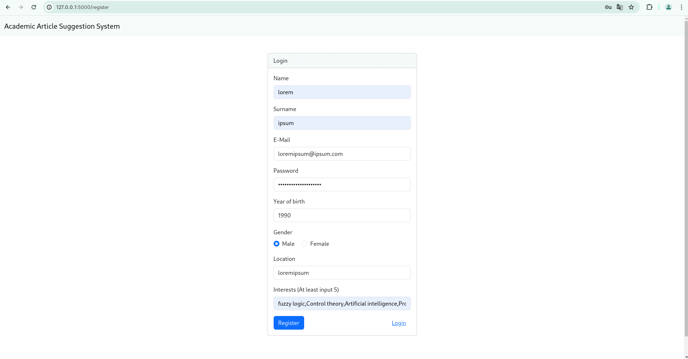

# Vectoral Article Suggestion System

This application creates a vector embedding of the abstract of articles. And makes recommendations based on the user's interests, reactions and reading history by measuring the cosine similarity. The left side of the screen shows the recommendations made with the fastText model and the right side shows the recommendations made with the scibert model.

The app was coded in a tight deadline and may not represent the best practices.

# Installation

Python 3.9 and MongoDB required

```
$ git clone https://github.com/th103/article-suggest
$ cd article-suggest
$ pip install -r requirements.txt
$ python -m spacy download en_core_web_sm
```

To download fastText model

```
$ python downloader.py
```

# Run

```
$ python app.py
```

# Screenshoots



# Models

https://github.com/allenai/scibert

https://github.com/facebookresearch/fastText/blob/main/LICENSE
